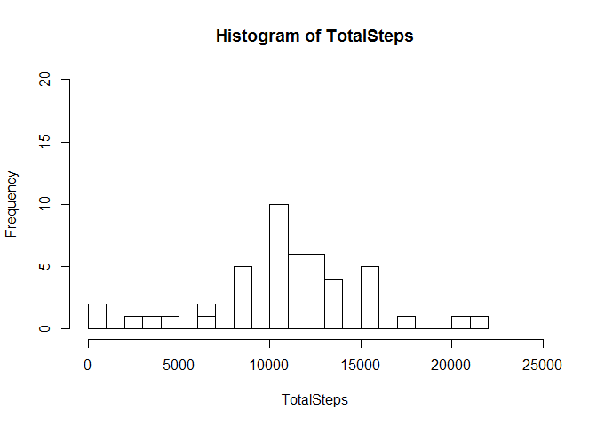
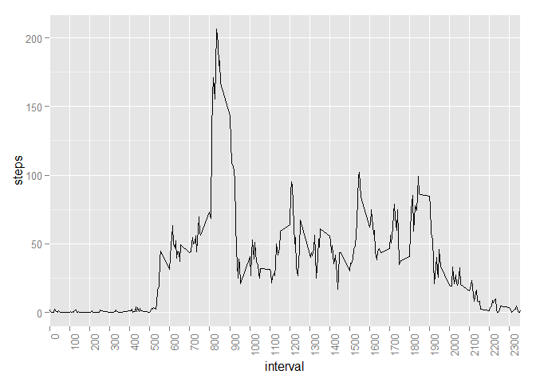
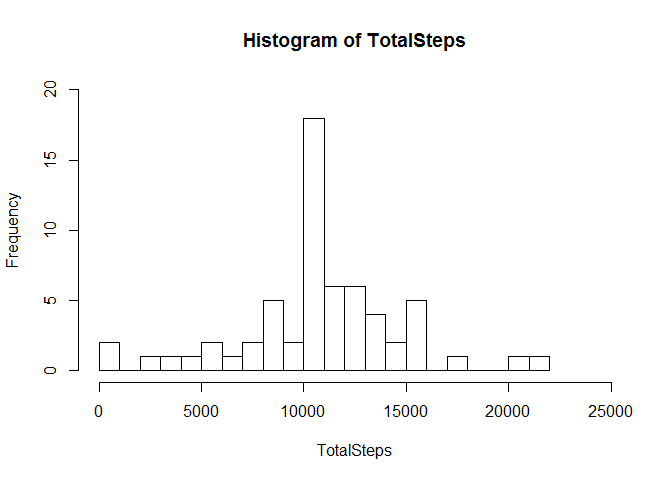
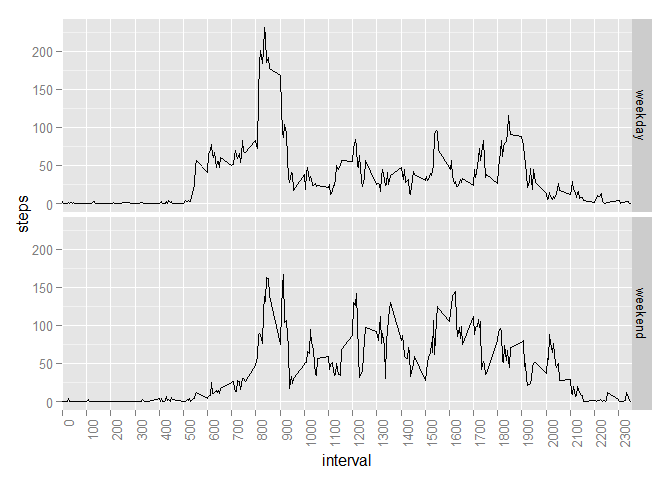
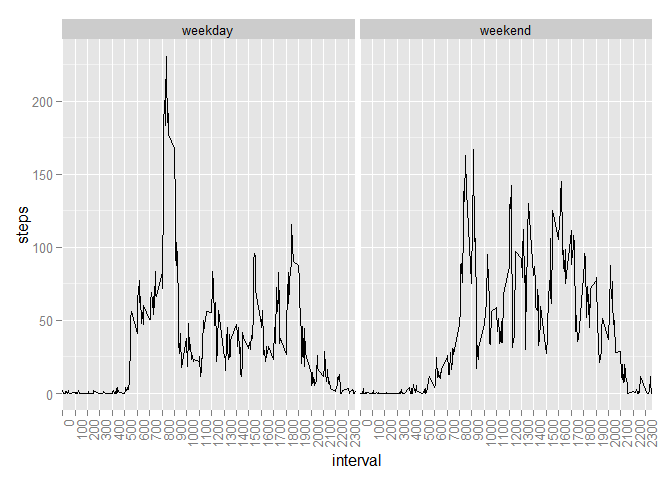

# Reproducible Research: Peer Assessment 1


## Loading and preprocessing the data
Code below is responsible for loading data. It is assumed that data is in the working directory.

```r
## read from the zipped data file
Data <- read.csv(unzip("./activity.zip"))
## rearrange columns, just for convenience
Data <- Data[, c(2,3,1)]
```

## What is mean total number of steps taken per day?

```r
## make an array of total number of steps per day
TotalSteps <- with(Data, tapply(steps, INDEX=date, FUN=sum))
## plot a histogram of total steps per day
hist(TotalSteps, breaks=16, xlim=c(0,25000), ylim=c(0,20))
```

 

```r
## obtain mean and median value, NAs need to be removed
TotalMean <- mean(TotalSteps, na.rm=TRUE)
TotalMedian <- median(TotalSteps, na.rm=TRUE)
TotalMean
```

```
## [1] 10766.19
```

```r
TotalMedian
```

```
## [1] 10765
```

##### Histogram shows data centered around mean and median

## What is the average daily activity pattern?
Make a time series plot (i.e. type = "l") of the 5-minute interval (x-axis) and the average number of steps taken, averaged across all days (y-axis)
<br> R code for creating the plot:

```r
library(ggplot2)
## create a data frame with average steps, across all days, per interval
IntervalAvg<-aggregate(list(steps=Data$steps), list(interval=Data$interval), mean,na.rm=TRUE)
## print out the average steps against intervel number, format x axis as discrete
ggplot(IntervalAvg, aes(interval, steps))+geom_line()+scale_x_discrete(breaks=seq(0, 2400, by=100))+theme(axis.text.x = element_text(angle = 90, hjust = 1))
```

 
<br> Which 5-minute interval, on average across all the days in the dataset, contains the maximum number of steps?
<br> R code for this calculation:

```r
IntervalAvg[which.max(IntervalAvg$steps),]
```

```
##     interval    steps
## 104      835 206.1698
```
## Inputing missing values
Calculate and report the total number of missing values in the dataset (i.e. the total number of rows with NAs)
<br> R code for calculating total number of missing values:

```r
sum(is.na(Data$steps))
```

```
## [1] 2304
```
Devise a strategy for filling in all of the missing values in the dataset. The strategy does not need to be sophisticated. For example, you could use the mean/median for that day, or the mean for that 5-minute interval, etc.
<br> The proposed strategy will be to use mean value for a given 5-minute interval, as in many cases NAs occur throughout the day
<br> Create a new dataset that is equal to the original dataset but with the missing data filled in.
<br> R code for filling in the missing data:

```r
## make copy of original data
DataCorrected<-Data
## in a loop, find all occurrences of NA in the dataset
for (i in 1:nrow(Data)){
  if (is.na(Data[i,"steps"])){
    temp<-Data[i,"interval"]
## fill in mean for specific interval for NAs
    DataCorrected[i, "steps"]<- IntervalAvg[IntervalAvg$interval==temp,2]
  }
}
```
Make a histogram of the total number of steps taken each day and Calculate and report the mean and median total number of steps taken per day. Do these values differ from the estimates from the first part of the assignment? What is the impact of imputing missing data on the estimates of the total daily number of steps?
<br> Running the code from first part of the assignment:

```r
## make an array of total number of steps per day
TotalSteps <- with(DataCorrected, tapply(steps, INDEX=date, FUN=sum))
## plot a histogram of total steps per day
hist(TotalSteps, breaks=16, xlim=c(0,25000), ylim=c(0,20))
```

 

```r
## obtain mean and median value
TotalMean <- mean(TotalSteps)
TotalMedian <- median(TotalSteps)
TotalMean
```

```
## [1] 10766.19
```

```r
TotalMedian
```

```
## [1] 10766.19
```
##### Histogram shows data even more centered around mean and median, which become equal to each other. That seems to be consequence of chosen strategy for replacing NAs.
## Are there differences in activity patterns between weekdays and weekends?
Create a new factor variable in the dataset with two levels -- "weekday" and "weekend" indicating whether a given date is a weekday or weekend day.
<br> R code for doing this (on corrected dataset):

```r
DataCorrected$is_weekend <- as.factor(ifelse(weekdays(as.POSIXct(DataCorrected$date)) %in% c("Saturday", "Sunday"), "weekend", "weekday"))
```
Make a panel plot containing a time series plot (i.e. type = "l") of the 5-minute interval (x-axis) and the average number of steps taken, averaged across all weekday days or weekend days (y-axis).
<br> R code for plotting:

```r
## create dataframe aggregated by interval and weekend/weekday
IntervalWeek<-aggregate(steps~interval+is_weekend, data=DataCorrected, mean)
## plot the data in two facets
## this plot resembles the assignment example
ggplot(IntervalWeek, aes(interval, steps))+geom_line()+facet_grid(is_weekend ~ .)+scale_x_discrete(breaks=seq(0, 2400, by=100))+theme(axis.text.x = element_text(angle = 90, hjust = 1))
```

 

```r
## this plot makes more sense in some respect
ggplot(IntervalWeek, aes(interval, steps))+geom_line()+facet_grid(. ~ is_weekend)+scale_x_discrete(breaks=seq(0, 2400, by=100))+theme(axis.text.x = element_text(angle = 90, hjust = 1))
```

 

##### The upper plot better displays the similarity between weekday and weekend activities. The lower plot better shows the difference in amount of activities between the two.
